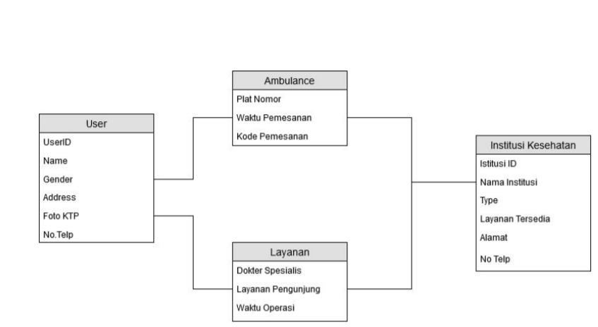

# Jaga.in

### Nama Anggota Kelompok 4 :
-Annisa Faradila  	**G64180074**  
-Arrazzaq Adrian  	**G64180109**  
-Hudzaifah Muttaqin	**G64180119**  

### Ringkasan 
   
   *Mobile Apps* ini berawal dari salah satu keresahan mengenai pelayanan kesehatan di daerah lingkungan kampus IPB Dramaga . 
IPB Dramaga ditempuh melalui akses jalan raya yang cukup padat dan heterogen sehingga pada beberapa wilayah yang masih berada di sekitar cakupan kampus IPB menjadi rawan dan beberapa faktor lainnya menyebabkan mahasiswa maupun pelintas yang melalui jalan raya rentan mengalami kecelakaan yang cukup tinggi.Selain itu beberapa mahasiswa terkadang kesulitan untuk mendapatkan akses kesehatan terutama dalam hal pemesanan ambulance.

### Latar Belakang  

   Kesehatan merupakan salah satu sektor yang menjadi fokus utama pembangunan pemerintah di Indonesia (Rappler, 2017). Berbagai upaya pemerintah dalam pembangunan di bidang kesehatan telah dilakukan. Mulai dari pemberian subsidi biaya kesehatan, peningkatan sumber daya manusia di sektor kesehatan, peningkatan sumber daya obat dan perbekalan kesehatan, pemberdayaan masyarakat, serta perbaikan manajemen kesehatan (Usman, Widhyharto, & Maika). Pelayanan kesehatan yang baik menjadi salah satu dambaan masyarakat. Mulai dari pelayanan dalam perawatan maupun sampai dengan penyaluran informasi. Namun Prosedur pemberian layanan kesehatan masih terkesan sulit dan membingungkan bagi sebagian orang sehingga penanganan pasien oleh tenaga kesehatan menjadi lambat (Rahim, 2016). Selain itu, masih sulitnya mencari bantuan layanan kesehatan serta aplikasi layanan kesehatan yang belum sesuai harapan (Peraturan Menteri kesehatan, 2017) dan masih banyak masalah-masalah lainnya sehingga diperlukan sebuah cara untuk mengatasi masalah tersebut, meskipun Bidang perawatan sudah diwadahi banyak rumah sakit ataupun lembaga kesehatan lainnya. Namun, segi penyaluran informasi belum sepenuhnya  terpenuhi dengan baik, seperti lokasi dan nomer telfon dari rumah sakit, posko darurat, serta ambulan terdekat. Keadaan mendesak tidak jarang membuat orang sulit berpikir jernih, hal ini menyebabkan suatu masalah menjadi semakin parah dan sulit teratasi. 
Aplikasi ini diharapkan mampu mewadahi info-info tersebut, sehingga kemudahan informasi seputar pelayanan kesahatan dapat dengan mudah diakses masyarakat khususnya lingkup Dramaga.

### Rumusan Masalah 

Rumusan masalah yang diangkat dalam proyek "**Jaga.in**” adalah berdasarkan karena adanya:
1.	Kesulitan mendapatkan informasi seputar layanan kesehatan khususnya mahasiswa IPB Dramaga.  
2.	Belum tersedia aplikasi pemesanan ambulance di IPB Dramaga.  

### Tujuan 

Adapun tujuan dari pembuatan proyek “**Jaga.in**” yaitu diantaranya:
1.	Perantara bagi mahasiswa yang membutuhkan pemesanan ambulance secara real time.  
2.	Mempermudah pencarian suatu Informasi layanan kesehatan  di Wilayah IPB Dramaga.  

### Batasan Masalah 

Batasan Masalah pada “**Jaga.in**” ini adalah : 
1.	Aplikasi ini hanya diperuntukkan ruang lingkup Masyarakat IPB Dramaga.  
2.	Setiap user harus memiliki nomer NIK (kartu identitas).  
3. Pemesanan ambulance dilakukan dengan perantara pihak ketiga (server admin rumah sakit).  

### Solusi Singkat 

Dengan adanya aplikasi **Jaga.in** maka akan tersedia informasi layanan kesehatan dan juga membantu memudahkan antara user dan admin rumah sakit untuk pemesanan ambulance.Dengan perantara ini diharapkan mahasiswa IPB tidak merasa kesulitan mencari layanan kesehatan dan juga untuk pemesanan ambulance.
 
### User Profile 
Target dari aplikasi **Jaga.in** adalah mahasiswa IPB yang kebingungan dalam mengakses layanan kesehatan apa saja yang tersedia di lingkungan kampus dan juga mahasiswa yang kesulitan 

### User Story 
1.	Sebagai seorang mahasiswa baru, saya kesulitan  mengetahui akses layanan kesehatan apa saja yang tersedia di wilayah sekitar kampus IPB Dramaga.
2.	Sebagai seorang mahasiswa,saya ingin mengetahui aplikasi apa yang dapat menolong saat emergency case dan saya membutuhkan bantuan pemesanan ambulance secara mendadak.
3.	Sebagai mahasiswa baru,saya membutuhkan informasi layanan kesehatan beserta jam operasionalnya.

# Skema 

#### Entity-Relational Diagram 

DESKRIPSI ERD NYA

#### Diagram Skematik

#### Use Case Diagram

.png)
 
#### Activity Diagram

![GAMBAR ACTIVITY DIAGRAM]
 
#### Class Diagram

![GAMBAR CLASS DIAGRAM]

# Hasil implementasi perangkat lunak

>Final Mockup :
https://www.figma.com/proto/1JsW8RaHTnjonH39uArdzD/menu-utama?node-id=94%3A946&scaling=scale-down
  

